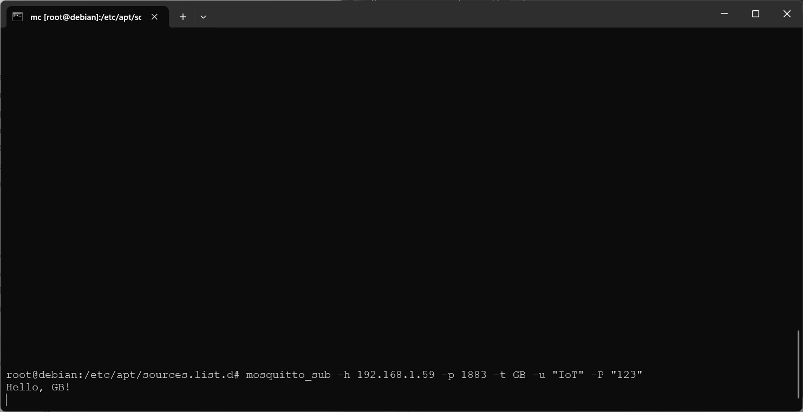
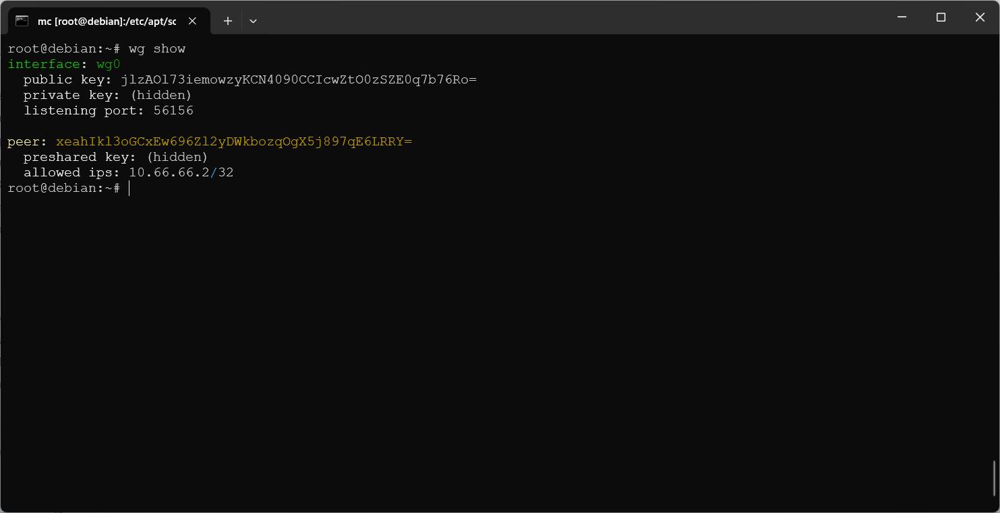
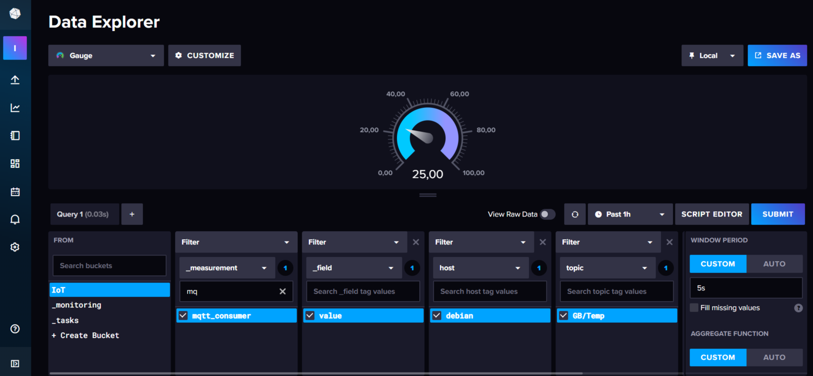
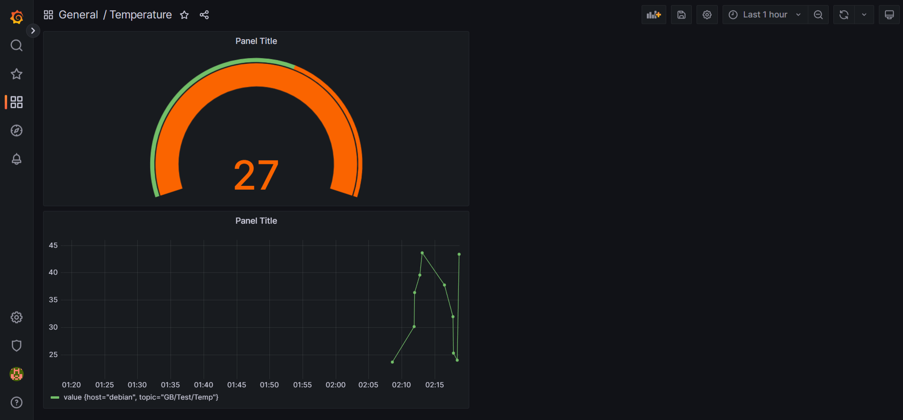
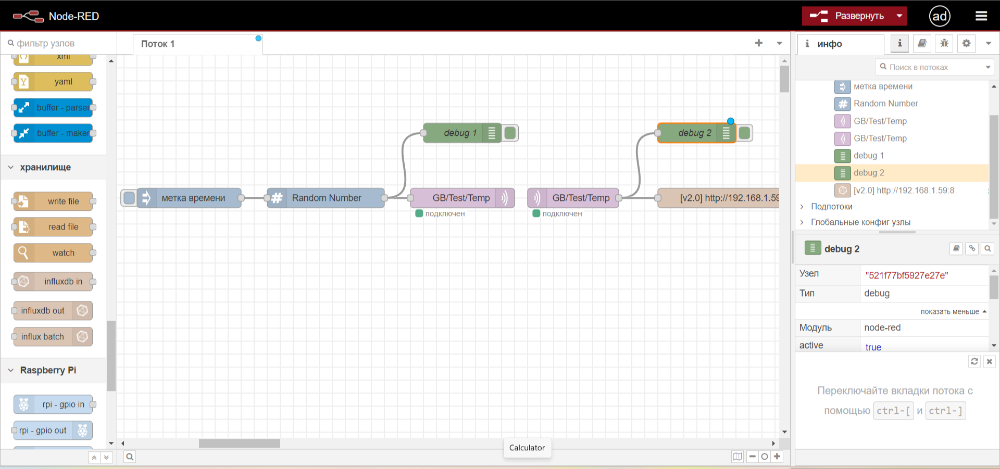

# Домашнее задание 1
Условие:
● Закрепить материалы практикума повторением всех действий из методички или записи вебинара.
● Прислать реквизиты доступа развернутой системы визуализации с актуальными и валидными данными. Если
нет возможности настроить выход системы в интернет, можно пристать скриншоты с локального доступа.
● Описать сложности, с которыми столкнулись при развертывании
Пример решения: см. семинар
Рекомендации для преподавателей по оценке задания:
Работа считается сданной, если выполнены следующие пункты:
● все компоненты системы должны быть доступны извне через интернет (если у студента была возможность сделать
выход системы с интернет) - необязательно, если у студента может отсутствовать техническая возможность.
● все компоненты системы должны быть развернуты локально (нужны скриншоты). - обязательно
● предоставлены скриншоты работы по отображению данных - обязательно

### Mosquitto
Для Debian 12 версия
wget http://ftp.ru.debian.org/debian/pool/main/o/openssl/libssl3_3.0.15-1\~deb12u1_amd64.deb && 
dpkg -i libssl3_3.0.15-1\~deb12u1_amd64.deb && 
rm libssl3_3.0.15-1\~deb12u1_amd64.deb && 
apt update && 
apt-cache show mosquitto | grep Version

Подписка
mosquitto_sub -h 192.168.1.59 -p 1883 -t GB -u "IoT" -P "123"

Отправка сообщения
mosquitto_pub -h 192.168.1.59 -p 1883 -t "GB" -m "Hello, GB!" -u "IoT" -P "123"

### WireGuard
wg show

## Grafana, InfluxDB, Telegraf

В учебнике неудачно поделено на строки
wget -q https://repos.influxdata.com/influxdata-archive_compat.key && 
echo '393e8779c89ac8d958f81f942f9ad7fb82a25e133faddaf92e15b16e6ac9ce4c influxdata-archive_compat.key' | sha256sum -c && 
cat influxdata-archive_compat.key | gpg --dearmor | sudo tee /etc/apt/trusted.gpg.d/influxdata-archive_compat.gpg > /dev/null && 
echo 'deb \[signed-by=/etc/apt/trusted.gpg.d/influxdata-archive_compat.gpg\]
https://repos.influxdata.com/debian stable main' | sudo tee /etc/apt/sources.list.d/influxdata.list && 
sudo apt-get install -y adduser libfontconfig1 && 
wget https://dl.grafana.com/oss/release/grafana_9.4.1_amd64.deb && 
sudo dpkg -i grafana_9.4.1_amd64.deb && 
sudo rm /root/grafana_9.4.1_amd64.deb && 
sudo systemctl enable grafana-server && 
sudo systemctl start grafana-server && 
sudo apt-get update && 
sudo apt-get install -y influxdb2 telegraf && 
sudo systemctl start influxd && 
sudo systemctl enable telegraf

### Telegraf

logfile = "/var/log/telegraf/telegraf.log"

### InfluxDB

### Grafana

### Node-RED

http://192.168.1.59:1880

